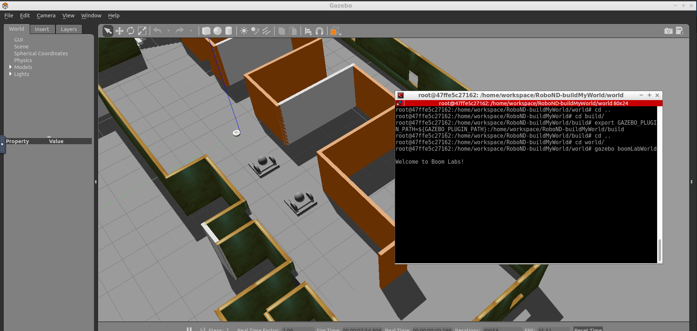

[](https://www.udacity.com/robotics)

# RoboND-buildMyWorld
The **buildMyWorld** project part of RoboND Gazebo Basics lesson. The purpose of this project is to learn the basics of Gazebo and also set up the environment for our robot in our upcoming projects.

### Directory Structure
```
    .buildMyWorld                           # buildMyWorld main folder 
    ├── images                         # Code output image                   
    │   ├── output.png
    ├── model                          # Model files for building and robots
    │   ├── boomLab
    │   │   ├── model.config
    │   │   ├── model.sdf
    |   ├── my2WRobot
    │   │   ├── model.config
    │   │   ├── model.sdf
    |   ├── two_wheeled_robot
    │   │   ├── model.config
    │   │   ├── model.sdf
    |   ├── two_wheeled_robot_barebones
    │   │   ├── model.config
    │   │   ├── model.sdf
    ├── script                         # Gazebo World plugin C++ script      
    │   ├── hello.cpp
    ├── world                          # Gazebo main World empty scene
    │   ├── boomLabWorld
    ├── CMakeLists.txt                 # Link libraries 
    └──                              
```

### Steps to launch the simulation

#### Step 1 Update and upgrade the Workspace image
```sh
$ sudo apt-get update
$ sudo apt-get upgrade -y
```

#### Step 2 Clone the lab folder in /home/workspace/
```sh
$ cd /home/workspace/
$ git clone https://github.com/maitiSoutrik/RoboND-buildMyWorld.git
```

#### Step 3 Compile the code
```sh
$ cd /home/workspace/RoboND-buildMyWorld/
$ mkdir build
$ cd build/
$ cmake ../
$ make
```

#### Step 4 Add the library path to the Gazebo plugin path  
```sh
$ export GAZEBO_PLUGIN_PATH=${GAZEBO_PLUGIN_PATH}:/home/workspace/RoboND-buildMyWorld/build
```

#### Step 5 Run the Gazebo World file  
```sh
$ cd /home/workspace/RoboND-buildMyWorld/world/
$ gazebo boomLabWorld
```

### Output
The welcome message and the two-wheeled robot, and irobot inside a custom made Gazebo World should both launch as follow: 



    
 
